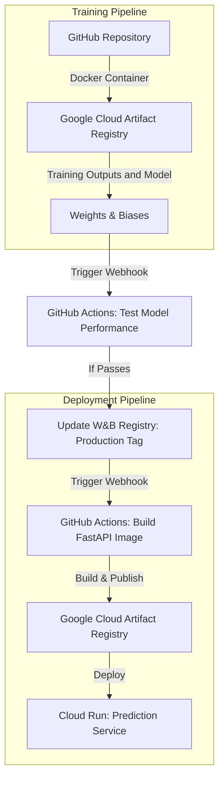

# Exam template for 02476 Machine Learning Operations

This is the report template for the exam. Please only remove the text formatted as with three dashes in front and behind
like:

`--- question 1 fill here ---`

Where you instead should add your answers. Any other changes may have unwanted consequences when your report is
auto-generated at the end of the course. For questions where you are asked to include images, start by adding the image
to the `figures` subfolder (please only use `.png`, `.jpg` or `.jpeg`) and then add the following code in your answer:

```markdown

```

In addition to this markdown file, we also provide the `report.py` script that provides two utility functions:

Running:

```bash
python report.py html
```

Will generate a `.html` page of your report. After the deadline for answering this template, we will auto-scrape
everything in this `reports` folder and then use this utility to generate a `.html` page that will be your serve
as your final hand-in.

Running

```bash
python report.py check
```

Will check your answers in this template against the constraints listed for each question e.g. is your answer too
short, too long, or have you included an image when asked. For both functions to work you mustn't rename anything.
The script has two dependencies that can be installed with

```bash
pip install typer markdown
```

## Overall project checklist

The checklist is _exhaustive_ which means that it includes everything that you could do on the project included in the
curriculum in this course. Therefore, we do not expect at all that you have checked all boxes at the end of the project.
The parenthesis at the end indicates what module the bullet point is related to. Please be honest in your answers, we
will check the repositories and the code to verify your answers.

### Week 1

- [x] Create a git repository (M5)
- [x] Make sure that all team members have write access to the GitHub repository (M5)
- [x] Create a dedicated environment for you project to keep track of your packages (M2)
- [x] Create the initial file structure using cookiecutter with an appropriate template (M6)
- [x] Fill out the `data.py` file such that it downloads whatever data you need and preprocesses it (if necessary) (M6)
- [x] Add a model to `model.py` and a training procedure to `train.py` and get that running (M6)
- [x] Remember to fill out the `requirements.txt` and `requirements_dev.txt` file with whatever dependencies that you
- [x] Remember to comply with good coding practices (`pep8`) while doing the project (M7)
- [x] Do a bit of code typing and remember to document essential parts of your code (M7)
- [x] Setup version control for your data or part of your data (M8)
- [x] Add command line interfaces and project commands to your code where it makes sense (M9)
- [x] Construct one or multiple docker files for your code (M10)
- [x] Build the docker files locally and make sure they work as intended (M10)
- [x] Write one or multiple configurations files for your experiments (M11)
- [x] Used Hydra to load the configurations and manage your hyperparameters (M11)
- [x] Use profiling to optimize your code (M12)
- [x] Use logging to log important events in your code (M14)
- [x] Use Weights & Biases to log training progress and other important metrics/artifacts in your code (M14)
- [ ] Consider running a hyperparameter optimization sweep (M14)
- [ ] Use PyTorch-lightning (if applicable) to reduce the amount of boilerplate in your code (M15)

### Week 2

- [?] Write unit tests related to the data part of your code (M16) - TODO: Update to use DVC
- [x] Write unit tests related to model construction and or model training (M16)
- [x] Calculate the code coverage (M16)
- [ ] Get some continuous integration running on the GitHub repository (M17)
- [x] Add caching and multi-os/python/pytorch testing to your continuous integration (M17)
- [ ] Add a linting step to your continuous integration (M17)
- [x] Add pre-commit hooks to your version control setup (M18)
- [x] Add a continues workflow that triggers when data changes (M19)
- [x] Add a continues workflow that triggers when changes to the model registry is made (M19)
- [x] Create a data storage in GCP Bucket for your data and link this with your data version control setup (M21)
- [x] Create a trigger workflow for automatically building your docker images (M21)
- [x] Get your model training in GCP using either the Engine or Vertex AI (M21)
- [x] Create a FastAPI application that can do inference using your model (M22)
- [x] Deploy your model in GCP using either Functions or Run as the backend (M23)
- [x] Write API tests for your application and setup continues integration for these (M24) - TODO: fetch model from w&bs
- [x] Load test your application (M24) - TODO: Maybe add workflow for Locust
- [x] Create a more specialized ML-deployment API using either ONNX or BentoML, or both (M25)
- [x] Create a frontend for your API (M26)

### Week 3

- [ ] Check how robust your model is towards data drifting (M27)
- [ ] Deploy to the cloud a drift detection API (M27)
- [x] Instrument your API with a couple of system metrics (M28)
- [ ] Setup cloud monitoring of your instrumented application (M28)
- [x] Create one or more alert systems in GCP to alert you if your app is not behaving correctly (M28)
- [ ] If applicable, optimize the performance of your data loading using distributed data loading (M29)
- [ ] If applicable, optimize the performance of your training pipeline by using distributed training (M30)
- [ ] Play around with quantization, compilation and pruning for you trained models to increase inference speed (M31)

### Extra

- [ ] Write some documentation for your application (M32)
- [ ] Publish the documentation to GitHub Pages (M32)
- [ ] Revisit your initial project description. Did the project turn out as you wanted?
- [ ] Create an architectural diagram over your MLOps pipeline
- [x] Make sure all group members have an understanding about all parts of the project
- [x] Uploaded all your code to GitHub

## Group information

### Question 1

> **Enter the group number you signed up on <learn.inside.dtu.dk>**
>
> Answer:

--- MLOPS 11 ---

### Question 2

> **Enter the study number for each member in the group**
> Answer:

--- s232793, s230354, s233483 ---

### Question 3

> **A requirement to the project is that you include a third-party package not covered in the course. What framework** > **did you choose to work with and did it help you complete the project?**
>
> Recommended answer length: 100-200 words.
>
> Example:
> _We used the third-party framework ... in our project. We used functionality ... and functionality ... from the_ > _package to do ... and ... in our project_.
>
> Answer:

--- Our project is built using the PyTorch framework, which has greatly facilitated the entire project lifecycle, including data preparation, model development, training, and predictions. The PyTorch ecosystem provided a solid foundation, allowing us to efficiently implement our models. Specifically, we utilized a pre-trained ResNet-50 model from the PyTorch Image Models package. This choice of framework not only simplified the implementation process but also provided access to extensive community support and a wide range of pre-built models. The flexibility and scalability of PyTorch have been crucial in achieving our project goals, highlighting the framework’s effectiveness in addressing machine learning challenges. ---

## Coding environment

> In the following section we are interested in learning more about you local development environment. This includes
> how you managed dependencies, the structure of your code and how you managed code quality.

### Question 4

> **Explain how you managed dependencies in your project? Explain the process a new team member would have to go** > **through to get an exact copy of your environment.**
>
> Recommended answer length: 100-200 words
>
> Example:
> _We used ... for managing our dependencies. The list of dependencies was auto-generated using ... . To get a_ > _complete copy of our development environment, one would have to run the following commands_
>
> Answer:

--- 

We managed our project dependencies using a `requirements.txt` file, which lists all the necessary Python packages and their specific versions. This file was auto-generated by running the `pip freeze` command, ensuring that all installed packages and their versions were captured. To replicate our development environment, a new team member would simply need to clone the project repository and run the following command in their terminal:

```bash
pip install -r requirements.txt
```

This command installs all the required dependencies as specified in the `requirements.txt` file, ensuring an identical setup to the development environment. By using this approach, we ensure consistency across all team members' environments and make the process of setting up the project straightforward for new developers.


Furthermore, we have divided the packages in several requirement files. The goal of this is reducing the running time when building environments. For example, we have a `requirements_backend.txt`, which contains the packages needed for running the FastAPI.


---

### Question 5

> **We expect that you initialized your project using the cookiecutter template. Explain the overall structure of your** > **code. What did you fill out? Did you deviate from the template in some way?**
>
> Recommended answer length: 100-200 words
>
> Example:
> _From the cookiecutter template we have filled out the ... , ... and ... folder. We have removed the ... folder_ > _because we did not use any ... in our project. We have added an ... folder that contains ... for running our_ > _experiments._
>
> Answer:


We tried to follow the structure inherited from the MLOps cookiecuter template, provided by this course.

The project structure is designed to be modular and organized. It includes automated configurations in .github/ and key files such as pyproject.toml to manage dependencies. Data is separated into data/raw and data/processed, while trained models are stored in models/. The template suggests using a src/ folder as the source for the model, api, etc. Our code instead, is organized under the mlsopsbasic/, with specific modules such as predic_model.py, which also contains the api. This is complemented by tests in tests/. In addition, docs/ centralizes documentation, notebooks/ contains exploratory analysis, and Dockerfiles are included for reproducible environments.


### Question 6

> **Did you implement any rules for code quality and format? What about typing and documentation? Additionally,** > **explain with your own words why these concepts matters in larger projects.**
>
> Recommended answer length: 100-200 words.
>
> Example:
> _We used ... for linting and ... for formatting. We also used ... for typing and ... for documentation. These_ > _concepts are important in larger projects because ... . For example, typing ..._
>
> Answer:

Yes, We used `pep8` to follow python's style guide. We use `ruff` to validate the code against unused imports/variables, incorrect indentation, etc.

The `ruff check` happens in a workflow connected to Github Actions. It is ran every time there is a pull request.

Additionally, we use pre-commit hooks. These are rules that the code must follow before being commited.
The hooks that we use are:

- trailing-whitespace: removes the whitespace at the end of lines in the files
- end-of-file-fixer: makes sure that every files ends with one newline character.
- check-yaml: validates YAML files and their format
- check-added-large-files: prevents large files from being added to the repository accidentally
- check-toml: makes sure that TML file are properly formatted.

These practices are crucial in larger projects, because they set the tone of high quality code. In a project with hundreds of files, it is important to be consistent. People have different styles of coding,but this makes it easy for new people to read the code and implement new code.

## Version control

> In the following section we are interested in how version control was used in your project during development to
> corporate and increase the quality of your code.

### Question 7

> **How many tests did you implement and what are they testing in your code?**
>
> Recommended answer length: 50-100 words.
>
> Example:
> _In total we have implemented X tests. Primarily we are testing ... and ... as these the most critical parts of our_ > _application but also ... ._
>
> Answer:

--- In total, we implemented **12 tests**, distributed across two files: `test_predict_mod.py` and `test_data.py`. The tests are focused on two main areas:

1. **Model Functionality**: In `test_predict_mod.py`, we test the model's initialization and output shape to ensure proper operation.
2. **Dataset Integrity**: In `test_data.py`, we verify the dataset is non-empty, contains valid images and masks, and that masks correspond to images.

These tests ensure both the segmentation model and dataset are functioning correctly.

---

### Question 8

> **What is the total code coverage (in percentage) of your code? If your code had a code coverage of 100% (or close** > **to), would you still trust it to be error free? Explain you reasoning.**
>
> Recommended answer length: 100-200 words.
>
> Example:
> *The total code coverage of code is X%, which includes all our source code. We are far from 100% coverage of our \*\* > *code and even if we were then...\*
>
> Answer:

--- question 8 fill here ---

### Question 9

> **Did you workflow include using branches and pull requests? If yes, explain how. If not, explain how branches and** > **pull request can help improve version control.**
>
> Recommended answer length: 100-200 words.
>
> Example:
> _We made use of both branches and PRs in our project. In our group, each member had an branch that they worked on in_ > _addition to the main branch. To merge code we ..._
>
> Answer:

--- Yes, our workflow included using branches and pull requests (PRs) to manage different tasks efficiently. We created separate branches for specific tasks, such as `hydra`, `api`, and `DVC`. These branches were not dedicated to a single user but were open for anyone working on that particular task. This allowed for collaborative development, where team members could contribute to the same branch without conflicts. Once the task was complete, we used pull requests to review and merge the changes into the main branch (during the project the branch `actions` was used as main branch). This process ensured that code was well-organized, changes were properly reviewed, and the version control system maintained a clean history of the development process. Using branches and PRs also helped in isolating features, making it easier to test and deploy without affecting the main codebase. ---

### Question 10

> **Did you use DVC for managing data in your project? If yes, then how did it improve your project to have version** > **control of your data. If no, explain a case where it would be beneficial to have version control of your data.**
>
> Recommended answer length: 100-200 words.
>
> Example:
> _We did make use of DVC in the following way: ... . In the end it helped us in ... for controlling ... part of our_ > _pipeline_
>
> Answer:

--- We did make use of DVC in our project. DVC was integrated to manage and version control our datasets, which significantly improved the handling of large data files. By using DVC, we were able to track changes in our data, ensuring that every team member worked with the correct version of the dataset at any given time. This helped maintain consistency throughout the project, especially when experiments required different data versions. Additionally, DVC allowed us to store large datasets remotely in cloud storage, which kept our Git repository clean and focused on code, while still making it easy to share and update data. Thought there was some issues in the implementation because google drive can not longer be used, in the end, DVC helped us streamline collaboration and maintain reproducibility across the entire project pipeline. It was also a crucial part of training the model in the cloud, since the data was stored in a bucket and could be accessed from the container. ---

### Question 11

> **Discuss you continuous integration setup. What kind of continuous integration are you running (unittesting,** > **linting, etc.)? Do you test multiple operating systems, Python version etc. Do you make use of caching? Feel free** > **to insert a link to one of your GitHub actions workflow.**
>
> Recommended answer length: 200-300 words.
>
> Example:
> _We have organized our continuous integration into 3 separate files: one for doing ..., one for running ... testing_ > _and one for running ... . In particular for our ..., we used ... .An example of a triggered workflow can be seen_ > _here: <weblink>_
>
> Answer:

Yes, our continuous integration is divided in 2 workflows:

- one for linting and code quality. This file is called `codecheck.yaml`. It install, `ruff`, runs it to check if the code follows the correct rules, and lastly, it automatically formats the code that diverges from the rules.

- one that runs all the 12 tests that we have created. It is called `tests.yaml`. It doesn't run all the tests that we have. It just runs the unittests for the model (`test_model.py`), and the tests concerning the data used (`tests_data.py`)

One example of how a successful triggered workflow looks in Github Actions is the following:
[this figure](figures/workflow_example_q11.png)
figures/workflow_example_q11.png

Link to workflow: https://github.com/LuigiElo/MLPOps/actions/runs/12873946844

## Running code and tracking experiments

> In the following section we are interested in learning more about the experimental setup for running your code and
> especially the reproducibility of your experiments.

### Question 12

> **How did you configure experiments? Did you make use of config files? Explain with coding examples of how you would** > **run a experiment.**
>
> Recommended answer length: 50-100 words.
>
> Example:
> _We used a simple argparser, that worked in the following way: Python my_script.py --lr 1e-3 --batch_size 25_
>
> Answer:

--- question 12 fill here ---

We made use of hydra files. We have a config file that organizes the settings of the project. It defines the directories for training, validation and test data, as well as the type of masks to use and the number of workers for data loading. The model is set yp with 11 classes. The training parameters include 10 epochs, a batch size of 8 and a learning rate of 0.0001. The learning decay is 0.0001 and the image size to 256x256 pixels.
We have integrated the experiment tracking with Weights and Biases.
Moreover, we have the option to do profiling, although we have it disabled.
TODO: Explain with coding examples of how you would run a experiment.

### Question 13

> **Reproducibility of experiments are important. Related to the last question, how did you secure that no information** > **is lost when running experiments and that your experiments are reproducible?**
>
> Recommended answer length: 100-200 words.
>
> Example:
> _We made use of config files. Whenever an experiment is run the following happens: ... . To reproduce an experiment_ > _one would have to do ..._
>
> Answer:
> TODO:
> We used config files and logging. Everything is tracked in Weights&Biases (W&B). Whenever an experiment would run, we would log it and save it in W&B to make sure that we can later reproduce the results of specific experiments.

By doing this, we were able to log all relevant details about each experiment, including hyperparameters, training and validation metrics, model configurations and system settings. We can see the logs in the dashboard in real time and compare results across multiple experiments. Lastly, we saved model checkpoints, to make sure that each experiment could be reproduced by reloading the recorded parameters and code.

### Question 14

> **Upload 1 to 3 screenshots that show the experiments that you have done in W&B (or another experiment tracking** > **service of your choice). This may include loss graphs, logged images, hyperparameter sweeps etc. You can take** > **inspiration from [this figure](figures/wandb.png). Explain what metrics you are tracking and why they are** > **important.**
>
> Recommended answer length: 200-300 words + 1 to 3 screenshots.
>
> Example:
> _As seen in the first image when have tracked ... and ... which both inform us about ... in our experiments._ > _As seen in the second image we are also tracking ... and ..._
>
> Answer:

[this figure](figures/wandb_q14.png)
TODO: NOT SURE IF THIS IS CORRECT!!

### Question 15

> **Docker is an important tool for creating containerized applications. Explain how you used docker in your** > **experiments/project? Include how you would run your docker images and include a link to one of your docker files.**
>
> Recommended answer length: 100-200 words.
>
> Example:
> _For our project we developed several images: one for training, inference and deployment. For example to run the_ > _training docker image: `docker run trainer:latest lr=1e-3 batch_size=64`. Link to docker file: <weblink>_
>
> Answer:


--- We developed several Docker images for our project, each serving a specific purpose: training, development, and deployment. The training image was used to run experiments and train the model, while the deployment image was used to serve the model via an API. To run the training image, one would execute the following command: `docker run trainer:latest`. This command would start a container based on the `trainer:latest` image with the specified learning rate and batch size. The Dockerfiles for these images were stored in the `docker` directory of our project . By using Docker, we ensured that our experiments were reproducible and isolated, allowing us to run the same code in different environments without worrying about dependencies or configurations.
In our project, we used Docker to containerize different stages of the workflow with 3 separate dockerfile: `api.dockerfile`, `predict_model.dockerfile` and `train_model.dockerfile`. The `api.dockerfile` sets up the API with uvicorn to serve predictions with our model. `predict_model.dockerfile` and `train_model.dockerfile` handle the model prediction and training processes respectively. Each dockerfile installs dependencies, copies necessary file to the container and sets the entry points to run the corresponding scripts. With Docker we can ensure consistency across environments, which makes the application reproducible and portable.


### Question 16

> **When running into bugs while trying to run your experiments, how did you perform debugging? Additionally, did you** > **try to profile your code or do you think it is already perfect?**
>
> Recommended answer length: 100-200 words.
>
> Example:
> _Debugging method was dependent on group member. Some just used ... and others used ... . We did a single profiling_ > _run of our main code at some point that showed ..._
>
> Answer:

--- question 16 fill here ---

## Working in the cloud

> In the following section we would like to know more about your experience when developing in the cloud.

### Question 17

> **List all the GCP services that you made use of in your project and shortly explain what each service does?**
>
> Recommended answer length: 50-200 words.
>
> Example:
> _We used the following two services: Engine and Bucket. Engine is used for... and Bucket is used for..._
>
> Answer:

--- The GCP services we utilized in our project are:
1. **Bucket**: Google Cloud Storage (GCS) was used to store and manage our datasets.
2. **Artifact Registry**: Google Artifact Registry was used to store and manage Docker images for deployment.
3. **Cloud Build**: Google Cloud Build was used to automate the building and testing of our Docker images.
4. **Compute Engine**: Google Compute Engine was used to run our training experiments and deploy our API.
5. **Cloud Logging**: Google Cloud Logging was used to monitor and log application events and errors.
6. **Vertex AI**: Google Vertex AI was used to train our model in the cloud, providing a managed ML platform for scalable and efficient model development.
7. **Cloud Run**: Google Cloud Run was used to deploy our FastAPI application for serving predictions via an API endpoint.
8. **Credentials**: Google Cloud IAM was used to manage access control and permissions for different team members and services. ---

### Question 18

> **The backbone of GCP is the Compute engine. Explained how you made use of this service and what type of VMs** > **you used?**
>
> Recommended answer length: 100-200 words.
>
> Example:
> _We used the compute engine to run our ... . We used instances with the following hardware: ... and we started the_ > _using a custom container: ..._
>
> Answer:

--- question 18 fill here ---

### Question 19

> **Insert 1-2 images of your GCP bucket, such that we can see what data you have stored in it.** > **You can take inspiration from [this figure](figures/bucket.png).**
>
> Answer:

[This figure](figures/gcp_bucket_q19.png) shows the bucket with our data, which is divided in `processed` and `raw`. Inside of `processed`, it is divided in `test`, `train` and `val`.

### Question 20

> **Upload 1-2 images of your GCP artifact registry, such that we can see the different docker images that you have** > **stored. You can take inspiration from [this figure](figures/registry.png).**
>
> Answer:

[This figure](figures/gcp_artifact_registry_q20.png) shows the overview of the docker images that we have stored in Google Cloud.

[This figure](figures/gcp_artifact_registry_2_q20.png) displays, in more detailed, one of the containers inside of the `container-train-registry`>`api`.

### Question 21

> **Upload 1-2 images of your GCP cloud build history, so we can see the history of the images that have been build in** > **your project. You can take inspiration from [this figure](figures/build.png).**
>
> Answer:

[This image](figures/gcp_build_history_q21.png) shows all the history builds, as well as the time that it took each one of them, and if they failed or succeeded.

### Question 22

> **Did you manage to train your model in the cloud using either the Engine or Vertex AI? If yes, explain how you did** > **it. If not, describe why.**
>
> Recommended answer length: 100-200 words.
>
> Example:
> _We managed to train our model in the cloud using the Engine. We did this by ... . The reason we choose the Engine_ > _was because ..._
>
> Answer:

--- question 22 fill here ---

## Deployment

### Question 23

> **Did you manage to write an API for your model? If yes, explain how you did it and if you did anything special. If** > **not, explain how you would do it.**
>
> Recommended answer length: 100-200 words.
>
> Example:
> _We did manage to write an API for our model. We used FastAPI to do this. We did this by ... . We also added ..._ > _to the API to make it more ..._
>
> Answer:

We developed an API for our model using **FastAPI**. The application, implemented in `predict_model.py`, defines a `/predict/` endpoint to handle image uploads and return pixel-level class predictions for segmentation. **Uvicorn** was used to run the app locally.

## Steps

1. **Set up FastAPI**:
   A FastAPI application was created, and logging was implemented to monitor performance and debug issues.

2. **Load the Model**:
   Using **Hydra**, we loaded the configuration and model path. The segmentation model was initialized in evaluation mode during FastAPI's startup event.

3. **Define `/predict/` Endpoint**:
   A POST endpoint was created to accept image files. Images were preprocessed by resizing, converting to tensors, and normalizing to match the model's requirements.

4. **Generate Predictions**:
   The preprocessed image was passed through the model, and predictions were returned as a JSON response.

5. **Run Locally**:
   **Uvicorn** allowed us to test the API locally before exploring cloud deployment options.

This approach provided a robust and user-friendly API, enabling easy image uploads and prediction retrieval for further processing.

---

### Question 24

> **Did you manage to deploy your API, either in locally or cloud? If not, describe why. If yes, describe how and** > **preferably how you invoke your deployed service?**
>
> Recommended answer length: 100-200 words.
>
> Example:
> _For deployment we wrapped our model into application using ... . We first tried locally serving the model, which_ > _worked. Afterwards we deployed it in the cloud, using ... . To invoke the service an user would call_ > _`curl -X POST -F "file=@file.json"<weburl>`_
>
> Answer:

--- For deployment, we wrapped our model into an application using FastAPI. We first tried locally serving the model, which worked. The FastAPI application was implemented in predict_model.py, where we defined an endpoint /predict/ to handle image uploads and return predictions of the class of each pixel to later perform segmentation. We used Uvicorn to run the FastAPI app locally.
To invoke the service an user would call:

```bash
curl -X POST -F "file=@path/to/your/image.jpg" http://127.0.0.1:8000/predict/
```

This command sends a POST request to the `/predict/` endpoint with the image file, and the API returns the predicted class of each pixel of the image. Additionally, images can also be uploaded directly in the host once the API is deployed ---

### Question 25

> **Did you perform any unit testing and load testing of your API? If yes, explain how you did it and what results for** > **the load testing did you get. If not, explain how you would do it.**
>
> Recommended answer length: 100-200 words.

--- Unit tests of the API were performed. Due to the non-optimal performance of the model, simple requirements were tested. The `test_predict_mod.py` file contains two tests: `test_predict_1` and `test_predict_2`. Both tests check the `/predict/` endpoint of the FastAPI application. They send a POST request with an image file and verify that the response status code is 200 and that the response JSON is not empty.

For load testing, we used Locust to simulate multiple users sending requests to the API simultaneously. The `locustfile.py` script defines a user behavior where a POST request is sent to the `/predict` endpoint. The load test was run with 10 users, spawning at a rate of 1 user per second, for a duration of 1 minute. The results included metrics like response time, throughput, and error rate, which helped us evaluate the performance of the API under load. This setup allowed us to identify potential bottlenecks and optimize the API for better performance. ---

### Question 26

> **Did you manage to implement monitoring of your deployed model? If yes, explain how it works. If not, explain how** > **monitoring would help the longevity of your application.**
>
> Recommended answer length: 100-200 words.
>
> Example:
> _We did not manage to implement monitoring. We would like to have monitoring implemented such that over time we could_ > _measure ... and ... that would inform us about this ... behaviour of our application._
>
> Answer:

We managed to implement monitoring. We measure some metrics in the API application by using `prometheus_client`. These metrics are `Counter` and `Histogram`.

The `Counter`we use to calculate the number of prediction error and the number of prediction requests. The `Histogram` we use to calculate the prediction latency in seconds. All these metrics we store in a registry that we created to not cluttered the output and be able to analyze only the metrics that we are interested in.

Furthermore, we have implemented an alert policy in Google cloud that sends an email to each member of the group when the number of requests to the endpoint is above a threshold.

In [this image](figures/alert_email_q26.png), you can see an example of an email received when the alert policy is fired.

## Overall discussion of project

> In the following section we would like you to think about the general structure of your project.

### Question 27

> **How many credits did you end up using during the project and what service was most expensive? In general what do** > **you think about working in the cloud?**
>
> Recommended answer length: 100-200 words.
>
> Example:
> _Group member 1 used ..., Group member 2 used ..., in total ... credits was spend during development. The service_ > _costing the most was ... due to ... . Working in the cloud was ..._
>
> Answer:

We spent 7.94kr of credits. This was the cost of each service:

- Cloud Run: 0.13kr
- Cloud storage 2.20kr
- VertexAI: 4.34kr
- Artifact Registry: 1.27kr

### Question 28

> **Did you implement anything extra in your project that is not covered by other questions? Maybe you implemented** > **a frontend for your API, use extra version control features, a drift detection service, a kubernetes cluster etc.** > **If yes, explain what you did and why.**
>
> Recommended answer length: 0-200 words.
>
> Example:
> _We implemented a frontend for our API. We did this because we wanted to show the user ... . The frontend was_ > _implemented using ..._
>
> Answer:

We implemented a Streamlit frontend for our image segmentation service that allows users to upload images and receive segmentation results. The frontend communicates with a Google Cloud Run backend API at "https://gcp-api-464642206755.europe-west1.run.app", handling image upload, sending requests, and displaying both the original and segmented images with error handling.

### Question 29

> **Include a figure that describes the overall architecture of your system and what services that you make use of.** > **You can take inspiration from [this figure](figures/overview.png). Additionally, in your own words, explain the** > **overall steps in figure.**
>
> Recommended answer length: 200-400 words
>
> Example:
>
> _The starting point of the diagram is our local setup, where we integrated ... and ... and ... into our code._ > _Whenever we commit code and push to GitHub, it auto triggers ... and ... . From there the diagram shows ..._
>
> Answer:

--- question 29 fill here ---




### Question 30

> **Discuss the overall struggles of the project. Where did you spend most time and what did you do to overcome these** > **challenges?**
>
> Recommended answer length: 200-400 words.
>
> Example:
> _The biggest challenges in the project was using ... tool to do ... . The reason for this was ..._
>
> Answer:

--- question 30 fill here ---

### Question 31

> **State the individual contributions of each team member. This is required information from DTU, because we need to** > **make sure all members contributed actively to the project**
>
> Recommended answer length: 50-200 words.
>
> Example:
> _Student sXXXXXX was in charge of developing of setting up the initial cookie cutter project and developing of the_ > _docker containers for training our applications._ > _Student sXXXXXX was in charge of training our models in the cloud and deploying them afterwards._ > _All members contributed to code by..._
>
> Answer:

--- question 31 fill here ---
